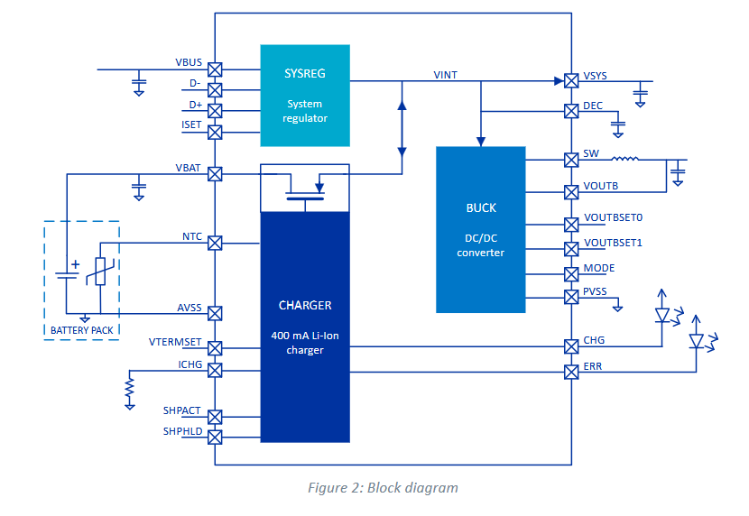
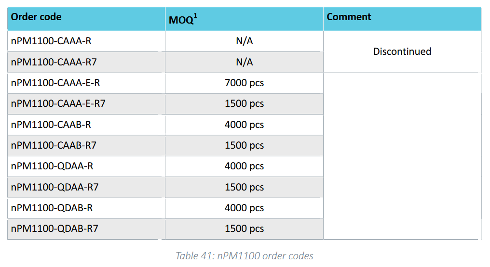
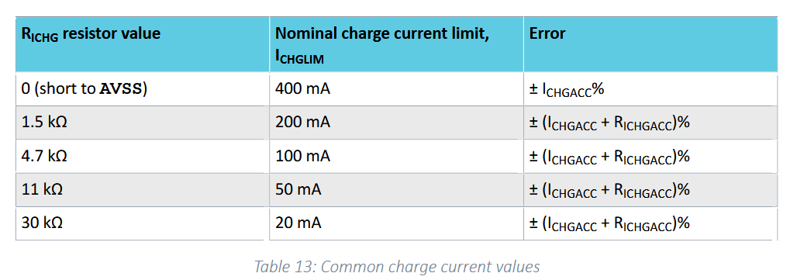
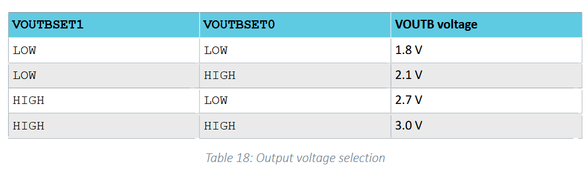
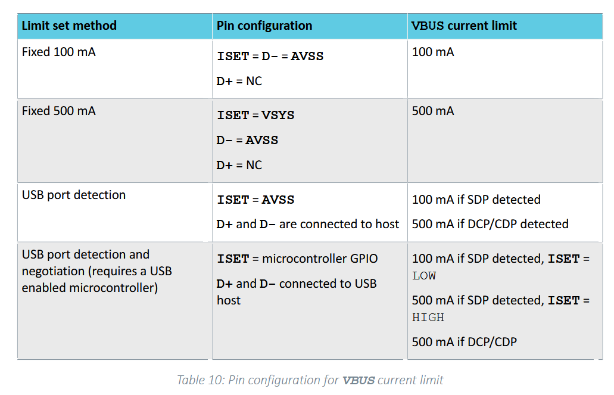

# PCB Design with the nPM1100 PMIC

This is documentaion written after the fact, if you want to read the 
design process as it was done, consider [the old readme](./README.old.md). 
I'll explain my model in two layers of abstraction.

1. Behaviour level
2. Pin level

## Behaviour level

A PMIC is typically used on a portable electronic device: like a mobile phone, 
a gaming mouse, a drone etc. it abstracts away the details of charging and battery
and provides a stable voltage and current to the microcontroller chip.

This means that our chip has the following

1. input (USB or barrel)
2. output (microcontroller)
3. inout (battery, which has to be charged and discharged)

and similarly out PMIC can itself be divided into subsystems

Now that we understand what the chip does on a high level, we need to check if this
is indeed the right chip for us to use, we can decide this by looking at the 
design requirements:

1. 3V DC output
2. 200mA charging
3. 35mmx35mm for the entire PCB

and we have been told to use the nordic semiconductor nPM1100 PMIC
with the QFN24 variant, which is 4mmx4mm.

First we make a ballpark estimate, then we consult the data sheet, the voltage ~ 3V
is pretty typical for a microcontroller so that makes sense, and the charging
current 200mA is pretty typical for a small LiPo battery, in say a drone.

The consumption current is probably less than that, and that would make the 
outut power a few hundred mW, which is also reasonable for a 35mmx35mm
chip to discharge

Now we consult the datasheet

### Package size

The 4mmx4mm package does indeed exist

> nPM1100 is an integrated Power Management IC (PMIC) with a linear-mode lithium-ion/lithium-polymer battery charger in a compact 2.1x2.1 mm WLCSP or 4.0x4.0 mm QFN package. It has a highly efficient DC/ DC buck regulator with configurable dual mode output.

and we can indeed order it, according to the datasheet, the exact variant we want is

> nPM1100-QDAA-XX

where the QD portion signifies the QFN package, and AA specifies the Vterm voltage

### Charging Current

We can indeed charge at 200mA 

> Configurable charge current with a resistor connected to the ICHG pin (from 20 mA to 400 mA)

and we need to use a 1.5k resistor according to the table

### Output voltage

We can indeed output a stable 3.0V using the buck regulator

> Configurable output voltage between 1.8 V and 3.0 

and we need to set both VOUTBSET pins high accourding to the table

## Pin Level

Now we have a high level overview of the scale and function of the chip, and we haev determined
that it can be appropriately used here, let us get into the nitty gritties. We need to make a few 
design choices

1. Which power input setting?

According to the datasheet, I can choose from four possible choices, of these I'm going to choose 
option 3, 

Why? Three reasons

a. We need atleast 200mA input for it to be able to charge the battery while also powering the device
and so I cant use the flat 100mA option
b. Flat 500mA is unsafe in the SDP case, in which case I risk bricking a laptop if I charge from that
essentially I wouldnt be following the USB spec
c. Exposing ISET requires (a) more pins to the MCU, and (b) also exposing the usb data line to the MCU
both of which, it may not have

2. Which battery parameters?
We need to set three parameters;

a. Ichg, which has to be 200mA and requires a 1.5k resistor (tolerance be damned :( )
b. Vtermset, which really depends on our battery, but I'll set it low, which is 4.1V cuz we're on standard
c. NTC, here I'll opt to just ignore this, because it seems that batteries with thermistors are rare
and it adds an extra pin, and we already need two pins for power and ground.

3. What sort of microcontoller header?

What do we absolutely need?
1. Vout
2. ground

What would be nice to have?
1. CHG
2. ERR

What would be _really_ nice to have?
1. Battery monitor with enable
2. Low battery indicator

What I'm not exposing?
1. MODE: why? the default is already automatic
2. ISET: I dont wanna expose the USB bus
3. SHPACT: too nihe a faeture to demand its own pin

