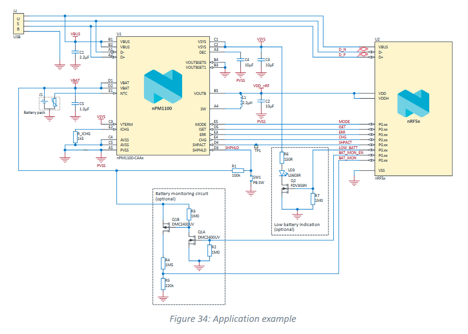
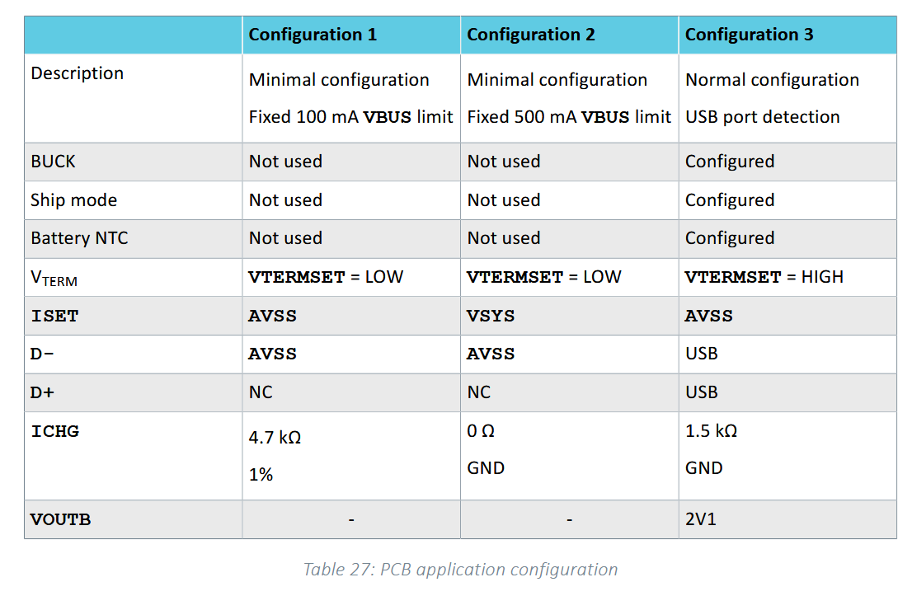
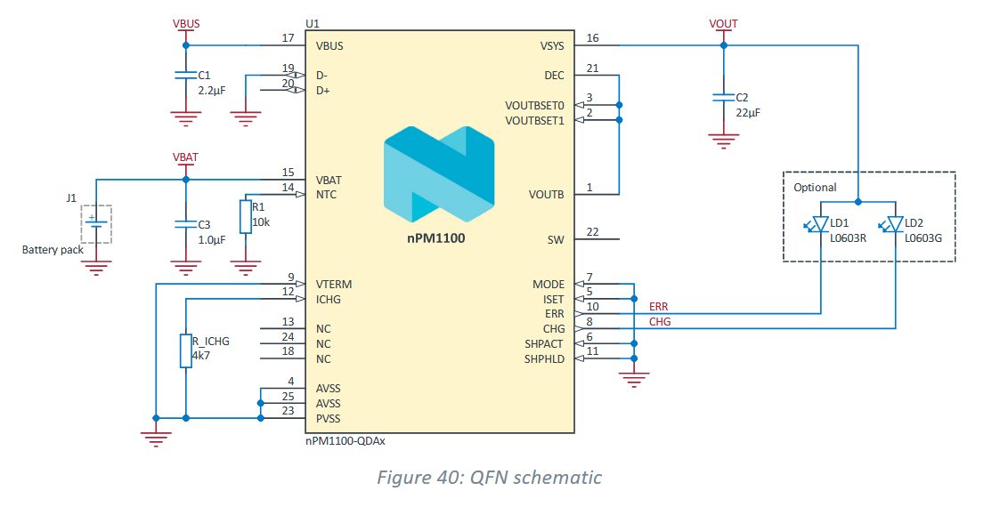

# PCB Design with the nPM1100 PMIC

So at first glance, here's what I understand of this task. The company NordicSemiconductors makes an IC which is used for "power management", more specifically from their own [site](https://www.nordicsemi.com/Products/nPM1100)

> The nPM1100 is a dedicated power management IC (PMIC) with a highly efficient dual-mode configurable buck regulator and integrated battery charger. It is designed as a complementary component to Nordic’s nRF52® Series and nRF53® Series System-on-Chips (SoCs) to ensure reliable power delivery and stable operation, whilst maximizing battery life through high efficiency and low quiescent currents. It can also be used as a generic PMIC device for any other suitable application.

the issue as I see it is that this is an IC, and so its very small and the pins are not useable, I also assume a bunch of capacitors and resistors are probably needed which an IC can not incorporate, so we need to build a PCB around it. 

So, whats the gameplan then?

1. Find out what the hell "power management" is, what is a power management IC expected to do, this should give us the (abstract) spec for our PCB
2. Find out what interface the nPM1100 IC exposes, and form a more detailed spec of what this PCB is supposed to do
3. Find out how to design a PCB (yeah this is a pretty big step, but its hard to say how to break it down 

The nRF52 and 53 are SoC's, essentially a chip that performs all the tasks that are needed for a small computer like device like a phone, or television or something like that, so basically it needs to provide power to another IC. They're also saying something about an integrated battery charger and a dual mode configurable buck regulator.

So lets have a look at the datasheet, I found one at [mouser](https://www.mouser.com/datasheet/2/297/nPM1100_PS_v1_3-3114436.pdf?srsltid=AfmBOoraNWuhPFjXlPD6XX4ZfLPLdKi7yKxcXCbtkNvv4RykF1eQ2tzv), but hey I read the PS again and apparently there's one on the main Nordic Site as well, but yeah they're the same thing, so it doesn't matter.

So there's a bunch of documents I should read apprently, but the trick I suppose is not to get lost in the weeds too long, the datasheet is supposed to be reference to cross check what I'm doing anyways

## Application Schematic

Welp, here's what I found. Skip straight to chapter 7, application, which starts with a schematic that does make a lot of things clear. Its an example application of using the nPM1100 to drive a nR5X (2 or 3 ig) so we've got three 4 main elements

1. The nR52X, the thing we're driving. 
2. The USB input that's providing the power (when connected)
3. A battery, thats providing the power when the USB is not connected and getting charged when it is
4. The nPM1100 which does the following things

Lets talk about each of these things in turn, 

### The SoC: nRF5X
I don't really care what it does, we're more concerned about its inputs over here, 

#### Power Inputs
1. VSS, the source (as in MOS) voltage, or the reference ground in whatever flavour of MOS this is, I don't really care about the nomenclature here, the only thing to note is that this is the ground plane, but also make note of the fact that PVSS exists, which is the power ground, they're the same voltage, but they're connected differently to prevent noise coupling it seems (chatgpt)
2. VDD and VDDH, this is the input voltage that drives the chip, value is like 3V type shi, VDDH is a way to do some voltage regulation and allow higher voltage inputs, we don't really care since we're doing it using the buck regulator (chatgpt)
3. VBUS, D+ and D-, this is the USB interface of the chip itself, note that both and and the PMIC are both connected to the USB, VBUS is only used for detection (chatgpt) to tell when the usb is connected and the D+ and D- are data pins used for communication, again, the PMIC should handle most of this, but we'll get into the weeds of this later

> VBUS is supplied to both nPM1100 and nRF5x to supply nPM1100 SYSREG and the nRF5x VBUS regulator.
#### Indictor Pins
These are directly connected to the PMIC and have the same name, they basically do three major things, (a) set the desired voltage (the voltage itself is hard coded here it seems) regulation and current needed (b) check if the battery is charging (and if there's an error due to say, water damage) and (c) put the chip into shipping mode. Additionally, it also monitors the battery to detect if its low on charge.
1. CHG 		get battery charging state
2. ERR 		get battery charging error state
3. MODE 	set the type of voltage regulation (automatic or forced pwm, see page 46)
4. ISET 	set the current I need to charge safely (1 to 500mA, but it depends on what the charger is capable of too)
5. SHPACT 	set the PMIC into shipping mode (I'll talk about this in detail later)
6. LOW_BATT	get the low battery state (you need an external monitoring circuit tho)
7. BAT_MON 	Hold on

### The Input power: USB (or not, but USB in this example)
USB, the universal serial bus is a standard that refers to a lot of connectors, but we're talking specifically about USB2, which is very simple, it has 4 pins, 

1. VBus
2. D+
3. D-
4. Gnd

and thats it, later versions have gotttern increasingly more complex, but here's what we need to know, D+ and D- form a serial line that allows the charging device to talk to the PMIC and the SoCk, we'll get into the protocol if we have to, but as far as I'm concerned I'll just slap on a USB2 port on to my PCB and get these 4 lines out. (3 if you dont count ground)

You do need to know about 

> Port negotiation can be performed after nPM1100 port detection. The nRF5x device and nPM1100 are both connected to USB in the application example. nPM1100 detects SDP or CDP/DCP. If SDP is detected, the USB device can negotiate with the USB host for higher current from VBUS.

#### The Battery
In the schematic this is pretty simple, but there's two main things to note here 
1. The charging cycle itself is rather complicated and I'll get into it if I need to
2. NTC allows you to monitor the thermals of the battery itself, and thats a large part of the PMIC's job as well

#### The PMIC itself: nPM1100
This ofcourse, deserves its own readme, all to itself, so I'll break down the matter later. But for now, I think I understand well enough what this IC does, we now need to either making a spec, or looking at how to fabricate a PCB

## Reference Circuits
On the first front, I can basically cheat, chapter 8 gives us a few example PCB circuits, 6 to be specific, 3 different levels of implementing the features and 2 different form factors (WLCSP or QFN), we're concerned with the QFN ones

Lets start with the most basic model, this is really very bare bones, it doesn't use the USB in, it doesnt use the V buck, no shipping, optional charging led, no thermal  regulation. 

So for now I can focus on just implementing this, excellent, saves the reading for later. How do you implement this schematic on a PCB?
So for no
